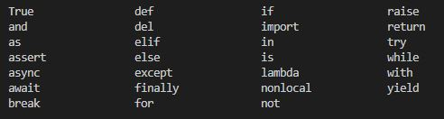

<div align="center">

[<< Geri](../README.md)

</div>

## **Keywords**

Basitçe anlatmak gerekirse _keywords_, programlama dilinin (yani burada Python'ın) kendisinin görevleri için ayrılmış kelimelerdir. Bunları önceden oluşturulmuş işlevler için kısayollar olarak düşünebilirsiniz. Bu sayede her seferinde bu görevler için bir kod yazmak zorunda kalmayız.

Python'da ```30```'dan fazla anahtar kelime bulunmaktadır.
```py
help()  # Komutu çalıştırdıktan sonra terminale "Keywords" yazın
```


Tabiki bunların hepsini aklınızda tutmanıza gerek yok. Kod yazarken anahtar kelimeleri yazdığınız zaman farklı renklerde olacağından tanıyabileceksiniz.

**Not:** Bu anahtar sözcükleri (Keywords) değişken tanımlada veya bir şeyleri adlandırmak için kullanamazsınız ```!``` ```!``` ```!```

## **Variables (_Değişkenler_)**

İsimlendirme yapmak istediğimizde değişkenleri (**_Identifiers_**) kullanırız. Kısaca Identifiers Python'daki temel nesneleri temsil eder ve bizler tarafından oluşturulur. Değişkenler (Variables), fonksiyonlar (Functions), sınıflar (classes), listeler (Lists), moduller (Moduls)...

Değişkenler nesnelere benzersiz bir ID verir. İster bu kimlikleri kullanarak isterseniz verdiğiniz isimleri aracılığıyla onlara erişebilirsiniz.

Python büyük ve küçük harfe duyarlı bir programlama dilidir.

İsim oluştururken uymanız gereken bazı kurallar var. Eğer bir yazılım dili biliyorsanız bu kurallara aşinasınızdır. Python'da ```"ad"``` ile ```"Ad"``` aynı Identifier değildir. Büyük harf, küçük harf, alt çizgi veya sayıları isimlendirmede kullanabilirsiniz. 

**Not:** Değişkenleri tanımlarken sayı ile başlamazlar fakat altçizgi ile başlatabilirsiniz. Son olarak sembolleri de kullanamazsınız !(ünlem işareti), @, #(hash sembolü), $ (dolar işareti), %(yüzde işareti)...


```py
# Değişken tanımlarken Özel semboller kullanılmaz (!, #, $, £ ...)
# Değişken adları rakam ile başlamaz
# Değişkenler büyük KÜÇÜK harf duyarlıdır. Case sensetive
# degis-ken = "Ayberk"  --> YANLIŞ
# degis ken = "Ayberk"  --> YANLIŞ
# Türkçe karakter kullanmayın.

FirstName = "Ayberk"
LastName = " Özkan"
print(FirstName + LastName) # Ayberk Özkan


# Çift veya Tek tırnak fark eder mi?
w = "Ayberk"
print(w)
w = 'Ayberk'
print(w)

# Bir değer birden fazla değişkene atanabilir.
t = u = g ="Mavi"
print(t, u, g)

T = '500'
U = '400'
print(T+U) # String birleştirme 500400


#Unpacking
Meyveler = ["Armut", "Muz", "Portakal"]
s, d, f = Meyveler  # s = Armut, d = Muz, f = Portakal
print(s, d, f)

# Veri tiplerinin uzunluklarını elde etmek için len() kullanılır.
# Ancak sayısal değerlerde hata verir.
# Sayılar tekrarlanamayan yapılar olduğu için kullanılamıyor.
isim = "Kenan Ayberk Özkan"
print(len(isim)) # 18
```

## **Notations**

Bir program yazılırken tanımlanan değişkenlerin (Identifiers) nasıl yazılacağına karar verilen bir yazılım kültürüdür.

Kısaca yazılımcıların kullandıkları yazım tarzına ```notasyon``` denir. Bunun amacı kodların rahat bir şekilde okunması, düzenli olması ve başkaları tarafından anlaşılmasını sağlamaktır.

```py
# Hungarian Notation / Macar Notasyonu
# Değişkenlerin tipine göre ön ekler kullanılıyor. 
sadsoyad =      # string'in s'si
iyas =          # int'in i'si

# Camel Notation / Deve Notasyonu
# 1. kelimenin ilk harfi küçük, birden fazla kelimeden oluşuyorsa 
# büyük harfleri büyük ile başlar. Tek kelime ise hepsi küçük yazılır
adiSoyadi = 
dogumTarihi = 

# Pascal Notation
# Kısaltmalar büyük yazılır. In/Out = IO
AdiSoyadi = 
DogumTarihi = 


# snake_case Notation
adi_soyadi = 
dogum_tarihi = 
```

## **Comments**

Python'da hash(#) ile başlayan herhangi bir satır yorumdur. Yorumlar, yazdığımız kodun daha okunabilir olması ve açıklamalar bırakabilmemiz için çok önemlidir. Python, kodumuzun yorum kısımlarını çalıştırmaz. 

-> Tek satır yorum yazımı;
```py
# Birinci yorum
# İkinci yorum
# Python çok güzel
```

-> Çok satırlı yorum yazımı;
```py
"""Birinci yorum
İkinci yorum
Python çok güzel
"""
```

## **Data Types**

Python'da birkaç çeşit veri türü vardır. En yaygın olanlarla başlayalım. Farklı veri türleri diğer bölümlerde ayrıntılı olarak ele alacağız. Şimdilik farklı veri türlerinin isimlerini görelim ve onlara kulak aşinalığı kazanalım.

- Numbers   (Integers, floats ve complex sayılar gibi.)
- Booleans  (True-False)
- Lists     (Listeler)
- Strings   (Karakterler)
- Dictionaries
- Tuples
- Sets
<div align="center">

[<< Geri](../README.md) & [Print Fonksiyonu >>](../1-Print%20Function/Print_func.md)

</div>
