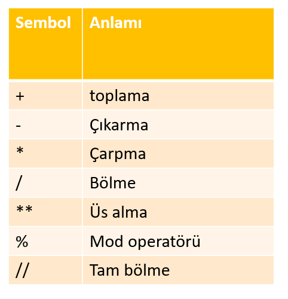
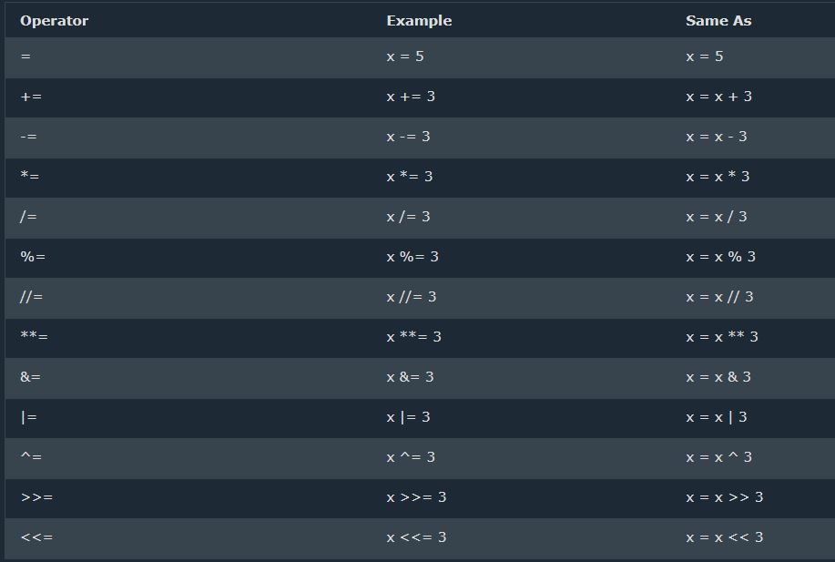
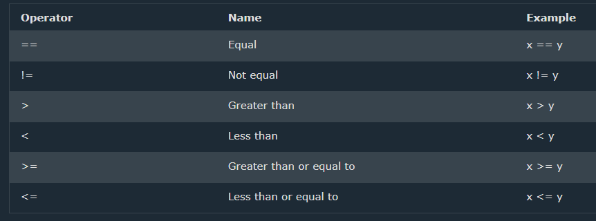
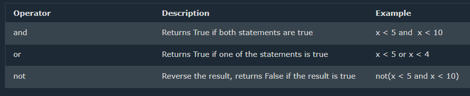

[<< Print Function]<!--(Link son iki kısım)--> || [Type Conversions >>]<!--(Link son iki kısım)-->

## **Matematiksel Operatörler (_Math Operators_)**
- Toplama (Addition) (+): x + y
- Çıkarma (Subtraction) (-): x - y
- Çarpma (Multiplication) (*): x * y
- Bölme (Division) (/): x / b
- Mod Alma (Modulus) (%): x % y
- Tam Bölme(Floor division) (//): x // y
- Üs (Exponentiation) (**): x ** y
  


**Örnek: Integers Tam Sayılar**

```py
print('Toplama: ', 1 + 2)      # 3
print('Çıkarma: ', 2 - 1)      # 1
print('Çarpma: ', 2 * 3)       # 6
print ('Bölme: ', 4 / 2)       # 2.0
# Bir sayıyı böldüğünüz zaman Python ondalıklı (float) bir değer verecektir
print('Bölme: ', 6 / 2)        # 3.0         
print('Bölme: ', 7 / 2)        # 3.5
print('Tam Bölme: ', 7 // 2)   # 3 
print ('Tam Bölme: ',7 // 3)   # 2
# Sayının bölümünden sonra ondalıklı kısmı ve kalan olmadan verir
print('Mod: ', 3 % 2)          # 1 Kalanı verir
print('Üs: ', 2 ** 3)          # 2 * 2 * 2 = 8
```
**Örnek: Floats Ondalıklı Sayılar**

```py
print('Pi Sayısı:', 3.1415)
print('Yer Çekimi:', 9,80665)
```
**Örnek: Karmaşık Sayılar**

```py
print('Karmaşık Sayı: ', 1 + 1j)
print('2 Karmaşık Sayının Çarpımı: ',(1 + 1j) * (1 - 1j))
```
**Örnekler**
```py
#   +
print(2+4+6+7+8+9)
#   -
print(120-30-40)
#   *
pi = 3.1415927
r = 4
cevre = 2*pi*r
print(cevre)
#   /
print(10/2, -10/3, 5/4)
#   %
print(10%2, -10%3, 5%4)
#   //
print(10//2, -10//3, 5//4)
#   **
print(5**1, 5**2, 5**3, 5**4)
#   min() ve max() Fonksiyonları en düşük veya en yüksek değeri bulmak için kullanılır.
x = min(5, 25, 125, 625)
y = max(625, 125, 25, 5)
print(x)
print(y)
#   abs() Mutlak Değer
z = abs(-40.25+20)
print(z)
#   pow(x,y) x üzeri y
w = pow(2,4)
print(w)
```
Öğrendiklerimizi birkaç örnekle daha pekiştirelim.

**-->**
```py
# Bir Dikdörtgenin alanını hesaplayalım.
length = 12     # Uzunluk
width = 25      # Genişlik
area = length * width
print('Dikdörtgenin Alanı:', area)

# Bir sıvının yoğunluğunu hesaplayalım.
kutle = 43      # Kg
hacim = 0.058   # Metreküp
yogunluk = kutle / hacim
print("Sıvının Yoğunluğu: ",yogunluk) # Kg/m^3

# Bir cismin ağırlığının hesaplanması
kutle = 43
yercekimi = 9.80665
agirlik = kutle * yercekimi
print(agirlik, 'N')                         # Ağırlığa birim ekleme
```

## **Atama Operatörleri (_Assignment Operators_)**

Değişkenlere değer atamak için atama operatörleri (Assignment Operators) kullanılır. Matematikte "=" işareti iki değerin eşit olduğunu göstersede Python'da belirli bir değişkende bir değer sakladığımız anlamına gelmektedir. Buna atama (Assignment) ya da bir değişkene değer atama (Assigning) diyoruz. Python'daki atama operatörlerinin gösterildiği tabloyu [w3schools](https://www.w3schools.com/python/python_operators.asp)'tan ulaşabilirsiniz.



**Örnekler: Atama Operatörleri**
```py
numbers = 5, 8, 1, 4, 13
x, y, z = 9, 2, 4

# x, y ve z'nin toplamının mod 4'ü nedir?

print((x + y + z) %4)

# x'in z'ye kalansız bölümünü hesaplayın.
print(x//z)

# y'nin z. kuvvetini hesaplayın.
print(y ** z)

# Kullanıcıdan aldığınız iki sayının çarpımı ile x, y ve z toplamının farkı nedir?
num_bir = int(input("1. Sayıyı Giriniz: " ))
num_iki = int(input("2. Sayıyı Giriniz: " ))
multiply = num_bir * num_iki
print((num_bir * num_iki) - (x + y + z ))

# x, *y, z = numbers satırına göre z'nin karesi kaçtır?
x, *y, z = numbers
print(y)
print(z ** 2)

# x, *y, z = numbers işlemine göre y'nin değerleri toplamı kaçtır?

toplam = y[0] + y[1] + y[2]
print(toplam)
```
## Boolean

Bu veri türünün kullanımı karşılaştırma operatörlerini kullandığınız zaman daha netleşecektir. _True_ ve _False_ olmak üzere iki değeri vardır.

**Örnek: Boolean İfadesi**
```py
print(True)     # 1
print(False)    # 0
```

## **Karşılaştırma Operatörleri (_Comparison Operators_)**

Programlamada öyle bir an gelirki 2 değeri karşılaştırmanız gerekir bu durumda **_Karşılaştırma Operatörleri_**'ni kullanmalısınız. Bu anlardan biri yazdığımız uygulamadaki gidişatı belirli koşullarda farklı yollara gitmesini istemek olabilir. Bir değerin diğer değere eşit olup olmadığını veya büyük olup olmadığını kontrol ederiz. Python'daki karşılaştırma operatörlerinin gösterildiği tabloyu [w3schools](https://www.w3schools.com/python/python_operators.asp)'tan ulaşabilirsiniz.



x ```>``` y<br>
x ```<``` y

Bu operatörler iki tür değeri karşılaştırır. _Büyüktür_ ve _küçüktür_. Sayılar için hangisinin daha büyük olduğunu görmek için sayısal değerleri karşılaştırırlar.

```py
4 > 2
# True
2 > 4
# False
```
Stringler içinse alfabetik sırasına göre karşılaştırır.
```py
"alpha" < "beta"
# True
"ayberk" < "kenan"
# True
"gamma" > "beta"
# True
"gamma" < "OMEGA"
# False
```
En sondaki karşılaştırmada gördüğünüz gibi küçük harfler _büyüktür_ olarak kabul edilir. Bu yüzden _False_ değerini bize verdi. Eğer hepsi büyük harf olsaydı alfabetik sıralama yapması beklenirdi.
```py
"GAMMA" > "OMEGA"
# True
```

### **Eşit değil**

```x != y``` <br>
x ve y eşit değilse _True_ değerini bize verecektir.
```py
4 != 15     
# True
4 != '4'
# True
4 != 4
# False
```
### **Eşittir**
```x = y``` <br>
x ve y eşit ise _True_ değerini bize verecektir.
```py
4 = 4
# True
'ayberk' = 'ayberk'
# True
'ayberk' = 'ayberk '
# False
'4' = 4
# False
```

**Örnek: Karşılaştırma Operatörleri**

```py
print(2 > 1)     # True, çünkü 2 büyüktür 1'den
print(2 >= 1)    # True, çünkü 2 büyüktür 1'den
print(2 < 1)     # False, çünkü 2 büyük değildir 1'den
print(1 < 2)     # True, çünkü 1 küçüktür 2'den
print(1 <= 2)    # True, çünkü 2 büyüktür 1'den
print(1 == 2)    # False, çünkü 2 eşit değildir 1'e
print(1 != 2)    # True, çünkü 1 eşit değildir 2'ye
print(len('mango') == len('karpuz'))   # False
print(len('mango') != len('karpuz'))   # True
print(len('mango') < len('karpuz'))    # True
print(len('two') != len('one'))        # False
print(len('two') == len('one'))        # True
print(len('domates') == len('patates'))# True
print(len('python') > len('react'))    # True
x, y, z = 100, 10, 20
print(x == 100)   # True
print(x != 10)    # True
print(y == z)     # False
print(y > z)      # False
print(y < z)      # True
print(y <= z)     # True
```

### **Zincirleme Karşılaştırmalar (_Chain Comparisons_)**

Birden çok karşılaştırma operatörüyle birden fazla ögeyi karşılaştırabilirsiniz.

**-->**
```py
x = 3
y = 2
z = 1
print(x > y > z)       # True
print(x > y and y > z) # Bu kod satırının kısaltılmış hali.

```
> **Not:** Genel matematik ```x != y != z```'nin x, y ve z'nin farklı değerlere sahip olduğunu bizlere söyler. ```0 != 1 != 0``` çalıştırıldığında, ```0 != 0``` yanlış olsa da _True_ değerini verecektir.


Uygun Syntax yapısına sahip olduğunuz sürece kaç tane öge ve karşılaştırma işlemi kullanacağınız konusunda teorik bir sınır yoktur.
```py
print(1 > -1 < 2 > 0.5 < 100 != 24)     # True
```

Yukarıdaki kod satırı, eğer her karşılaştırma operatörü _True_ değerini döndürürse _True_ değerini döndürecektir. Bu kadar karmaşık zincirleme karşılaştırma kullanmak iyi bir yazım değildir. İyi bir zincirleme karşılaştırma, kendisinden daha karmaşık olmamalı.

Bir karşılaştırma _False_ değerini döndürür döndürmez, ifade kalan tüm karşılaştırma operatörlerini atlayarak _False_ olarak değerlendirir ```! ! !```
**-->**
```py
# Girilen 2 sayıdan hangisi büyüktür?
bir = int(input('1. Sayıyı Giriniz: '))
iki = int(input('2. Sayıyı Giriniz: '))
print(f'1. Sayı ({bir}) 2. Sayıdan ({iki}) büyüktür: {bir > iki}')
# if bloklarını henüz öğrenmedik. Öğrendiklerimizden yola çıkarak yapıyoruz.
# Kullanıcıdan Vize (%40) ve Final(%60) notunu alıp ortalama hesaplayın.

vize = float(input('Vize Notunu Girin: '))
final = float(input('Final Notunu Girin: '))
vize = vize * 0.4
final = final * 0.6
ort = (vize + final)
print(f'Not Ortalamanız: {ort} \nDersten Geçme Durumunuz: {ort >=50}')

# Girilen bir sayının tek mi çift mi olduğunu yazdırın.
a = int(input('Bir sayı giriniz: '))
cift = (a % 2 == 0)
print(f'Girilen sayının Çift olma durumu: {cift}')
# Aynı sayının negatif mi pozitif mi olduğunu yazdırın.
print(f'Girilen sayının pozitif olma durumu: {a > 0}')
# Parola ve E-mail bilgisini isteyip doğruluğunu kontrol edin.
# (email: kenan.ayberk@github.com parola: Abc2134!)     

email ='kenan.ayberk@github.com'    # Sanki database'de kayıtlıymış gibi düşünelim.
paswrd = 'Abc2134!'
inputEmail = input('E-mail: ')
inputPswrd = input('Password: ')
print(f'Girilen E-mail adresi: {email == inputEmail.strip()}\nŞifre: {paswrd == inputPswrd}')
# Eğer kullanıcı mail adresini girerken yanlışlıkla başına veya sonuna boşluk girerse False değeri karşımıza çıkacaktır.
# Bunu önlemek için .strip() kullandık
```
## **Benzerlik Operatörleri (_Identity Operators_)**

```py
x = y = [1, 2, 3]   # --> y listesini tanımlarken x ile aynı adreste olacak bir liste tanımlamış olduk.
z = [1, 2, 3]    # --> z için ise ayrı bir adrese tanımlı liste tanımladık.
print(x == y)   # True
print(x == z)   # True
print(x is y)   # True
print(x is z)   # False Çünkü objelerin aynı olup olmadığını karşılaştırır yani farklı adreslere sahipler.
w = [2, 4]
print(x is w)   # False Zaten farklı adreslere sahipler
# Biraz daha zorlaştıralım.
del x[2]        # x listesindeki 3'ü sildik.
w[1] = 1        # w listesindeki 4'ü 1 ile değiştirdik.
w.reverse()     # w = [1, 2]
print(x == w)   # True
print(x is w)   # False
print(x is not w)   # True

```

### **Karşılaştırma Yaparken 'is' ve '==' Arasındaki Fark**

``` x == y ``` --> x ve y'nin değerlerini karşılaştırır. <br>
``` x is y``` --> x ve y'nin kimliklerini yani id numaralarını karşılaştırır.
```py
x = 'Python is fun!'
y = 'Python is fun!'
x == y                      # True
x is y                      # True
a = 1000
b = 1000
print(a is b)               # True
print(3 ** 3 is 27)         # True
print(5 ** 128 is not 25)   # True
```
## **Üyelik Operatörleri (_Membership Operators_)**
Karakter dizisi veya bir sayı, bir veri tipinin içerisinde bulunuyorsa bunu kontrol etmemizi sağlarlar.<br>
``` in ``` --> Belirtilen değere sahip bir dizi varsa True
Öğrendiklerimizi birkaç örnekle daha pekiştirelim.<br>
```not in``` --> Belirtilen değere sahip bir dizi yoksa True
> **Not:** Sayısal değerlerde kullanılmaz. ```!``` ```!``` ```!```
```py
x = ['elma', 'erik']
print('erik' in x)      # True
print('karpuz' in x)    # False
print('karpuz' not in x)# True
isim = "Ayberk"
print("A" in isim)      # True
print("a" in isim)      # False
```

## **Mantıksal Operatörler (_Logical Operators_)**
Mantıksal operatörler, koşullu ifadeleri birleştirmek için kullanılır. Diğer programlama dillerinden farklı olarak Python, mantıksal operatörler için ```and```, ```or``` ve ```not``` sözcüklerini kullanır.Python'daki mantıksal operatörlerinin gösterildiği tabloyu [w3schools](https://www.w3schools.com/python/python_operators.asp)'tan ulaşabilirsiniz.


```py
# and
# True True = True
# False True = False

print(2 > 1 and 4 > 3) # True - Çünkü iki durumda doğru
print(2 > 1 and 4 < 3) # False - Çünkü 2. durum yanlış
print(5 < 3 and 6 < 4) # False - Çünkü iki durumda yanlış
print('True and True: ', True and True)     # True
print('True and False: ', True and False)   # False
print('False and False: ', False and False) # False
x = 3
y = 4
print(x == 3 and y == 4 > 0)        # True
print(x != 0 and y > -1)            # True

# or
# True True = True
# True False = True
# False False = False
print(2 > 1 or 4 > 3)  # True - Çünkü iki durumda doğru
print(2 > 1 or 4 < 3)  # True - Çünkü durumlardan biri doğru
print(6 < 5 or 6 < 4)  # False - Çünkü iki durumda yanlış
print('True or False:', True or False)  #True
print(x < 0 or y <= 0)              # False
print(x > 0 or y < 0)               # True

# not
# True True = False
# True False = False
# False False = True
print(not (x < 5))                  # False
print(not True)                     # False 
print(not False)                    # True
print(not not True)                 # True
print(not not False)                # False
print(not 2 > 1)       # False - Çünkü 2 > 1'den True gelir not True = False
```
Öğrendiklerimizi birkaç örnekle daha pekiştirelim.<br>
**-->**
```py
# Girilen bir sayının 0 - 100 arasında olup olmadığını kontrol ediniz.

sayi = int(input('Bir sayı giriniz: '))
print(f'Bu sayının ({sayi}), 0 ile 100 arasında olma durumu: {sayi > 0 and sayi < 100}')

# Aynı sayının pozitif ve çift sayı olup olmadığını kontrol ediniz.

print(f'Bu sayının ({sayi}), pozitif ve çift olma durumu: {(sayi % 2 == 0) and (0 < sayi)}')

# E-mail ve parola bilgileri ile giriş kontrolü yapın.

email ='kenan.ayberk@github.com'    # Sanki database'de kayıtlıymış gibi düşünelim.
paswrd = 'Abc2134!'
inputEmail = input('E-mail: ')
inputPswrd = input('Password: ')
print(f'Girilen Bilgilerinizin Doğruluğu: {email == inputEmail.strip() and paswrd == inputPswrd}')

# Girilen 3 sayıyı büyüklük olarak karşılaştırın

num_bir = float(input('1. sayıyı giriniz: ')) 
num_iki = float(input('2. sayıyı giriniz: ')) 
num_uc  = float(input('3. sayıyı giriniz: ')) 

print(f'1. Sayı({num_bir}) en büyüktür: {num_bir > num_iki and num_bir > num_uc}')
print(f'2. Sayı({num_iki}) en büyüktür: {num_bir < num_iki and num_iki > num_uc}')
print(f'3. Sayı({num_uc}) en büyüktür: {num_bir < num_uc and num_iki < num_uc}')

# Kullanıcıdan vize (%40) ve final (%60) notunu alıp ortalama hesabı yapın ve geçme durumunu karşılaştırın.
# Ortalama 50 olsa bile final notu en az 50 olmalıdır !
# Finalden eğer 70 ve üstü alınırsa ortalamanın hiçbir önemi olmasın !

vize = float(input('Vize Notunu Girin: '))
final = float(input('Final Notunu Girin: '))
vize1 = vize * 0.4
final1 = final * 0.6
ort = (vize1 + final1)
print(f'Not ortalaması: {ort}\nDersten geçme durumu: {(ort >= 50) or (final >=70)} ')

# Kişinin ad, soyad ve kilo bilgilerini alıp kilo indekslerini hesaplayın
# Formül = (Kilo / Boy^2)
# 0 - 18.4      --> Zayıf
# 18.5 - 24.9   --> Normal
# 25.0 - 29.9   --> Kilolu
# 30.0 - 34.9   --> Obez

name = input('Adınızı giriniz: ')
surname = input('Soyadınızı giriniz: ')
tall = float(input('Boyunuzu giriniz (metre): '))
kg = float(input('Kilonuzu giriniz: '))
formul = kg / (tall ** 2)
zayif = (formul >= 0) and (formul <=18.4)
normal = (formul > 18.4) and (formul <= 24.9)
kilolu = (formul > 24.9) and (formul <= 29.9)
obez = (formul > 29.9) and (formul <= 34.9)
print(f'{name +" "+ surname} kilo indeksiniz: {formul}\nKilo değerlendirmeniz zayıf: {zayif}')
print(100*'-')
print(f'{name +" "+ surname} kilo indeksiniz: {formul}\nKilo değerlendirmeniz normal: {normal}')
print(100*'-')
print(f'{name +" "+ surname} kilo indeksiniz: {formul}\nKilo değerlendirmeniz kilolu: {kilolu}')
print(100*'-')
print(f'{name +" "+ surname} kilo indeksiniz: {formul}\nKilo değerlendirmeniz obez: {obez}')
print(100*'-')
```

[<< Print Function]<!--(Link son iki kısım)--> || [Type Conversions >>]<!--(Link son iki kısım)-->