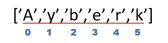

<div align="center">

[<< Type Conversion](../3-Type%20Conversions/Type_Conversion.md) & [Lists >>]

</div>


# **Strings**  (_Dizeler_)

Metin bir _```String```_ veri türüdür. Tek, çift veya üçlü alıntı içindaki tüm veriler, kısaca metin olarak yazılan herhangi bir veri türü de bir _```String```_'tir. Tırnak içinde gösterilen bitişik bir karakter kümesi olarakta tanımlanır.

Stringler değişmez bir veri türüdür, yani bir string'de her değişiklik yapıldığında, tamamen yeni bir string nesnesi oluşturulur.

Bir string'in uzunluğunu kontrol etmek için ```len()``` metodunu kullanırız.

## **Stringlerdeki Karakterlere _Index_ Numarasından Erişmek**
<br>
<br>

Programlamada sayma her zaman sıfırdan başlar. Bu nedenle bir dizenin ilk karakteri ```0``` Indexine yazılır. Son karakteri ise dizenin uzunluğunun 1 eksiğidir. Eğer sondan dizeye başlamak istiyorsak yani negatif indexleme yapmak istiyorsak son karakter ```-1```'dir.

<div align="center"> 



</div>
<br>

```py
karakter_dizisi = "Bu bir karakter dizisidir."
print(len(karakter_dizisi))
print(karakter_dizisi[0])       # Stringler 0'dan başlar
print(karakter_dizisi[1])
print(karakter_dizisi[-4])      # Sondan istenilen karakteri kullanmak için
print(karakter_dizisi[-3])
print(karakter_dizisi[-2])
print(karakter_dizisi[-1])
# print(karakter_dizisi[100]) karakter sayısını aşarsak hata verir.
print(karakter_dizisi[:10])     # Parçalar halinde çekebiliriz.

# Stringlerin karakterleri modifiye edilemez çünkü stringler değiştirilebilir değildir. Denenirse "typeError"
# karakter_dizisi[0] = "b"  Kısaca listeler gibi değiştirilemiyor
```

### **Multiline (_Çok Satırlı_) String Örneği;**

```py
multiline_string = '''Bu bir multi line yani çok satırlı
bir string
örneği
312343123423
'''
print(multiline_string)
```

### **String Birleştirme (_String Concatenation_)**

Alttaki örnekte ```name```, ```surname```, ```age``` ve ```space```'i information adlı değişkende birleştirelim. ```age```'in int olduğunu unutmayın.

```py
name = "Ayberk"
surname = "Özkan"
age = 24
space = ' '
information = name + space + surname + space + str(age)
print(information)
```

Stringleri birleştirme işlemine _**String Concatenation**_ denir


## **String Formatting**

İnsanların daha rahat bir şekilde görmesi için verileri depolarken ve dönüştürürken (Formatting) String biçimlendirme çok önemli hale gelmektedir. Python'da Stringleri biçimlendirmenin birçok yolu var.

### **Eski Tarz (_% Operatörüyle_)**

- %s String (Veya String temsil eden nesneler de (Sayılar gibi))
- %d Integers
- %f Floating

```py
first_name = 'Ayberk'
last_name = 'Özkan'
age = '24'
formated_string = 'I am %s %s. %s years old.' %(first_name, last_name, age)
print(formated_string)

# Stringler ve Sayılar
yari_cap = 5
pi = 3.14159
area = pi * yari_cap ** 2
formated_string2 = "%d cm yarı çaplı dairenin alanı: %.4f'dir." %(yari_cap, area)
print(formated_string2)
# .4f virgülden sonra 4 basamak alınmasını gösteriyor.
```

### **Yeni Tarz (_.format Kullanarak_)**


```py
print("My name is {} {}".format(name, surname))                 # Sırası önemli !
print("My name is {1} {0}".format(name, surname))               # İndex numarası ile sıralayabilirsin.
print("My name is {s} {n}".format(n = name, s = surname))       # Değişken tanımlayabilirsin.
print("My name is {} {} and I'm {}".format(name, surname, age)) # Tür Dönüşümü yapmadık.

result = 222 / 7
print(" The result is {}".format(result))                       # 31.714285714285715
print(" The result is {r:.6}".format(r = result))               # 31.7143
print(" The result is {r:.6f}".format(r = result))              # 31.714286
print(" The result is {r:.6e}".format(r = result))              # 3.171429e+01
print(" The result is {r:.0%}".format(r = result))              # 3171%
print('{ilk} {son}'.format(ilk='ash nazg', son='durbatuluk'))   # ash nazg durbatuluk
print('{0:x}'.format(10))       # Hexadecimal a
print('{0:X}'.format(10))       # Hexadecimal A
print('{0:c}'.format(64))       # Unicode Karakterler
print('{0:o}'.format(14))       # Oktal
print('{0:b}'.format(14))       # Binary
z = 44.0
print('{0:b}'.format(z))        # Sadece int sayılar çevrilebilir !
print('{:.>10}'.format('ayberk'))                   # ....ayberk
print('{:.<10}'.format('ayberk'))                   # ayberk....
print('{:{}{}{}}'.format('ayberk','*','^', 14))     # ****ayberk****    ^ --> tam ortaya yerleştirdi. (<, >)


```


>**Not:** _str.format_, %'nin vãrisidir ve örneğin birden çok yerine koyma işlemini gerçekleştirmeyi kolaylaştırarak daha fazla esneklik sunar.


### **_f_-string**

Başka bir yeni String biçimlendirmesi ise _String Interpolation_ yani _f-String_'lerdir. Stringler _```f```_ ile başlar ve verileri karşılık gelen konumlarına yerleştirir. 

```py
print(f"My name is {name} {surname} and I'm {age}.")
```

## **String Metodları**

Tek tek açıklamak yerine gelin direk örneklere dalalım.

```py

message = "Hey ! My name's Ayberk Özkan"
message = message.upper()           # Bütün karakterler BÜYÜK
print(message)
message = message.lower()           # Bütün karakterler küçük
print(message)
message = message.title()           # Her Kelimenin Baş Harfi Büyük
print(message)
message = message.capitalize()      # Bir karakter dizisinin sadece ilk harfi büyük
print(message)
print(message.swapcase())           # Büyük harfleri küçük harflere, küçük harfleri büyük harflere dönüştürür.
message = message.split()           # Herhangi bir string ifadeyi parçalara ayırır.
print(message)                      # Boşluk karakterlerinden bölünür ve ayrı string ifade olur. (Dizi)     
print(message[4])
print(message[5])
message ="*".join(message)          # Birleştirirken araya "yıldız" gelsin.   
print(message)                      # Bölünmüş karakter dizilerini tekrar bir araya getirmek için. Bölünmüş karakter dizileri "list" veri tipine girer
print(message.find("Ayberk"))       # Aramak istenilen kelimeyi parantez içine yazıyoruz daha sonra bize index numarası veriyor.
print(message.find("ayberk"))       # Pozitif bir değer veriyorsa aradığımız kelime yada veri mevcut, -1 yok demektir.
# find() soldan aramaya başlarken rfind() sağdan aramaya başlar.
# index() ve rindex() find metotlarına benzerler. Aranılan karakter karakter dizisinde yoksa ValueError hatası verecektir.
isim = "AYBERK"
print(isim)
print(isim.isupper())               # Tamamen büyük harflerden mi oluşuyor
print(isim.islower())               # Tamamen küçük harflerden mi oluşuyor
print("-----------------------------")
message1 ="  Boşluk  "              # Başta ve sonda 2 boşluk var
print(message1.strip())             # Boşluk karakterini silmek için
print(message1.lstrip())            # Sadece soldaki boşlukları silmek için
print(message1.rstrip())            # Sadece sağdaki.
araba = "araba"
print(araba.strip("a"))
print(araba.lstrip("a"))
print(araba.rstrip("a"))
print("-----------------------------")
is_found = message.startswith("H")  # H ile mi başlıyor
print(is_found)                     # True
is_found = message.startswith("*")  # * ile mi başlıyor
print(is_found)                     # False
is_found2 = message.endswith("n")   # n ile mi bitiyor
print(is_found2)
message = message.replace("*"," ")  # Cümle içerisinde bir arama yapar ve girilen veriyi değiştirir.
                                    # Yıldız karakterleri yerine boşluk kullansın
print(message)                      # .replace ard arda kullanabilirsin
print("-----------------------------")
message2 = "Kazandığınızdan en emin olduğunuz an, kaybetmeye en yakın olduğunuz andır."
message2 = message2.replace("an","zaman")
print(message2)                     # Her "an" geçen yeri "zaman"la değiştirecektir.
message = message.center(100)       # Verilen string ifadeyi 100 karakterlik bir bilgi içerisine alır ve tam ortalar
print(message)
message3 = "Beni 50 Karakter Ortala"
message3 = message3.center(50,"-")
print(message3)
print(message2.count("a"))          # Karakter dizisinin içerisinde belirlediği karakterden ya da karakter grubundan kaç tane olduğunu
sayılar = [1, 5, 10, 3, 20, 15, 1000, 2] # [1, 2, 3, 5, 10, 15, 20, 1000]
print(sorted(sayılar))              # Verileri küçükten büyüğe sıralamak için kullanılır
sırala = "harfler"                  # ['a', 'e', 'f', 'h', 'l', 'r', 'r']
print(sorted(sırala))
print(sorted("coğrafya"))           # Python sıralamayı kendi bünyesindeki sırasına göre yapıyor bu yüzden ğ en sonda.
import locale                       # locale kütüphanesini importladık
locale.setlocale(locale.LC_ALL,"Turkish_turkey.1254")
print(sorted("coğrafya", key = locale.strxfrm)) # ['a', 'a', 'c', 'f', 'ğ', 'o', 'r', 'y']
print("-----------------------------")
translation_table = str.maketrans("aeiou","12345")
message4 = "Bu bir karakter verisi!"
print(message4.translate(translation_table))
print("-----------------------------")
print(dir(""))                      # Bütün karakter dizisi yöntemlerini görmemizi sağlar
```

## **String Modulü**

Modul kullanımını henüz görmedik fakat bunu burada göstermek daha doğru olur diye düşünüyorum. 

```py
import string                       # String modulünü içeriye aktarıyoruz.

print(string.ascii_letters)         # ASCII
print(string.ascii_lowercase)       # ASCII küçük
print(string.ascii_uppercase)       # ASCII büyük
print(string.digits)                # Tüm decimal karakterler
print(string.hexdigits)             # Hexadecimal
print(string.octdigits)             # octal
print(string.punctuation)           # Noktalama işaretleri ve diğer işareteler 
print(string.whitespace)            # \t\n\r\x0b\x0c
print(string.printable)             # Bütün hepsi

```

## **Stringleri Ters Çevirmek**

Bir stringi çevirmenin birçok yolu vardır. Bunlardan biride ```reversed()``` fonksiyonunu kullanmaktır.

```py
isim = "AYBERK"
print(isim)
print(reversed(isim))                   # <reversed object at 0x000002B7B7EB3C40>
print(''.join(reversed(isim)))          # KREBYA
```
Fakat daha kolay bir yolu var,  belki aklınıza geldi bile :)

```py
print(isim[::-1])
```


>Öğrendiklerimizi pekiştirmek için aşağıdaki örneklere uygulayalım. Lütfen önce kendiniz çözmeye çalışın.


```py
github = "https://github.com/AyberkOzkan"
ataturk = "Zafer, 'Zafer benimdir' diyebilenindir. Başarı ise, 'Başaracağım' diye başlayarak sonunda 'Başardım' diyebilenindir."

# " Hello World " karakter dizisinin baş ve sondaki boşluk karakterlerini silin.
hw = " Hello World "
print(hw.strip())
#  "https://github.com/AyberkOzkan" AyberkOzkan dışındaki her karakteri silin.
github1 = "https://github.com/AyberkOzkan"
github1 = github1.strip("https://github.com/")
print(github1)
# "ataturk" karakter dizisinin tüm karakterlerini büyük harf yapın.
print(ataturk.upper())
# "github" içinde kaç tane "a" harfi vardır?
print(github.count("a"))
# "github", "https" ile başlayıp "com" ile bitiyor mu?
print(github.startswith("https"))
print(github.endswith("com"))
# "github" içinde .com ifadesi var mı?
print(github.find(".com"))
print(github.index(".com"))
# "ataturk" içindeki karakterlerin hepsi alfabetik mi? (Harflerden mi oluşur?)
print(ataturk.isalpha())
print(ataturk.isspace())
print(ataturk.istitle())
print(ataturk.islower())
print(ataturk.isupper())
print(ataturk.isalnum())
print(ataturk.isdigit())    # Rakamlar için
# "Python" ifadesini satırda 50 karakter içine yerleştirip sağına ve soluna "-" ekleyin
py = "Python"
print(py.center(50,"-"))
print(py.ljust(50,"-"))
print(py.rjust(50,"-"))
# "ataturk" karakter dizisindeki tüm boşluk karakterlerini "*" ile değiştirin.
print(ataturk.replace(" ","*"))
print(ataturk.replace(" ","*",6))
# "Hello World" karakter dizisin "Hello" ifadesini "This" olarak değiştirin.
print(hw.replace("Hello","This"))
# "ataturk" karakter dizisini boşluk karakterlerinden ayırın.
print(ataturk.split(" "))
```

Son olarak aşağıdaki isterleri kodlayıp bir sonraki konuya geçebiliriz.

```py
""" 

    Üç harften oluşan bir karakter dizisi tanımlayın ve bu karakter dizisinin ögelerine indeksler
    yardımıyla baştan ve tersten olmak üzere iki ayrı şekilde ulaşıp ekrana yazdırın.

"""

"""
    Aşağıdaki değişkenin ilk 10 karakterini döngü kullanmadan ekrana bastırın.
    d = "Karakterler önemli değişkenlerdir"
"""
"""
    Aşağıdaki paragrafta geçen kelimelerden en uzun olanı bulunuz ve görüntüleyiniz.
max() metotunu kullanın.

paragraf = """Python'un son derece kolay okunabilir olması düşünülmüştür. Bu yüzden örneğin küme parantezleri yerine girintileme işlemi kullanılır. Hatta bazı durumlarda girintileme işlemine dahi gerek kalmadan kodun ilgili bölümü tek satırda yazılabilir. Böylece Python, program kodunuzu en az çaba ile ve hızlıca yazmanıza imkan tanır. Sade söz dizimi ile diğer programlama  dillerinden üstündür."""

"""

"""
    Aşağıdaki cümlede 'programlama' kelimesinin hangi indekste başladığını bulun.
                                                                                
cumle = " Bilgisayarların donanıma nasıl davranacağını anlatan, bilgisayara yön veren komutlar, kelimeler, aritmetik işlemlerdir. Diğer bir tanım verecek olursak programlama, bilgisayar programlarının yazılması, test edilmesi ve bakımının yapılması sürecine verilen isimdir."

"""

"""
Bir siteye üyelikte girilecek isimlerin veri tabanında tamamen büyük harflerden
oluşacak şekilde kaydedileceğini varsayalım. Bir kullanıcı ismi tanımlayın ve 
kullanıcının isminin bütün harflerini büyük harflere çeviren bir kod yazın.

"""

""" 

Verilen cümlenin başındaki ve sonundaki özel sembolleri çıkarın. Daha sonra 
Türkçe ünlü harfler olan İ, Ö, Ü, ü, ö harflerini I, O, U, u ve o ile değiştirin.
cumle2 = "<<Öz, İl, ülke, Ülkem, göl>>"

"""
```

> [Cevaplar](b%20-%20String_Methods/String_Methods_Examples_2.py)


<div align="center">

[<< Type Conversion](../3-Type%20Conversions/Type_Conversion.md) & [Lists >>]

</div>